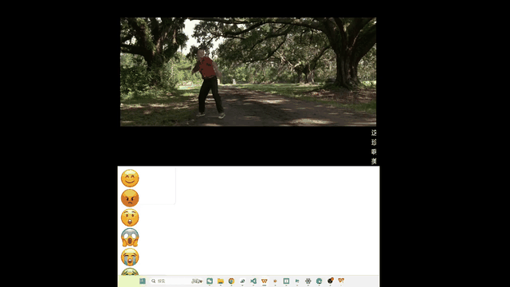

# DyEmo-movieDanmu
### Danmu captures temporal and state-space structure in population-level emotion dynamics.
Emotions are inherently dynamic, yet their fine-grained temporal and multidimensional organization remains difficult to characterize in naturalistic settings. To examine how emotional expression unfolds at the population level, we derived second-level, multidimensional trajectories from 7.57 million temporally anchored Danmu comments spanning 198 hours of naturalistic viewing, with large language models used for semantic inference. The resulting trajectories converged with human judgments and neural responses and remained robust across language models, independent audience samples, posting periods, and linguistic contexts. Different emotion dimensions exhibited distinct temporal signatures in persistence, variability, and transition properties, and these dynamics predicted audience engagement beyond static emotion profiles. When considered jointly, the emotion trajectories occupied a shared low-dimensional space organized by polarity, complexity, and intensity, with states concentrated around a recurrent central basin and varying systematically in activation, blending, and trajectory speed toward the periphery. Together, these findings reveal temporal and state-space organization of population-level emotion dynamics and demonstrate the value of temporally aligned digital traces for observing such dynamics at scale.

The Jupyter Notebooks provide code for reproducing figures in this paper:

`reproduce_figure1.ipynb`: Figure 1. LLM-based framework for inferring emotion dynamics via crowdsourced Danmu.

`reproduce_figure2.ipynb`: Figure 2. Performance of LLMs in Danmu-based emotion inference.

`reproduce_figure3.ipynb`: Figure 3. Alignment of LLM-derived emotion ratings with human ratings based on Danmu and movie viewing.

`reproduce_figure4.ipynb`: Figure 4. Reliability of LLM-derived six-dimensional emotion dynamics.

`reproduce_figure5.ipynb`: Figure 5. Basic emotion dynamic properties derived from 102 full-length films.

`reproduce_figure6.ipynb`: Figure 6. Core dimensions and density distributions of the emotion dynamic space.

`reproduce_figure7.ipynb`: Figure 7. Co-occurrence of emotions in naturalistic movies.

### Usage
git clone https://github.com/ncclab-sustech/DyEmo-movieDanmu.git

cd DyEmo-movieDanmu

conda env create -f environment.yml

conda activate your-env-name

### System requirements
The code was run on a Windows 11 operating system. We recommend running the code in an Anaconda environment. See environment.yml for dependencies and versions. The installation typically requires several minutes.

